# GitHub-session   

GitHub is a development platform that enables you to host and review code, manage projects, and build software alongside 50 million developers.

## How to Publish your projects in GitHub with the easiest way

  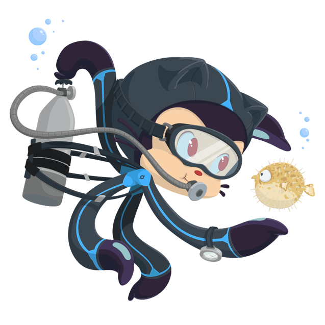

### 1.Fork a repo
Forking a repository makes a copy of the repository in your GitHub account. The parent repository is referred to as the upstream while your forked copy is referred to as the origin. Once you've forked a repository into your GitHub account you can clone it to your local machine. Forking allows you to freely make changes to a project without affecting the original upstream repository

  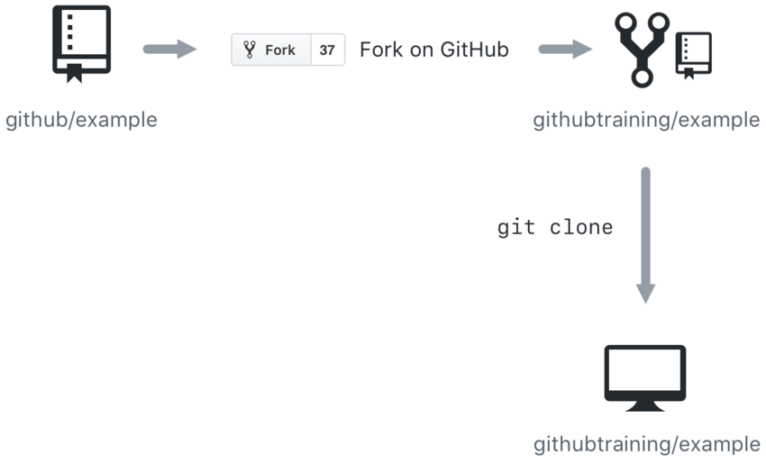

First you open the repo that you want to work on , then click in 'fork' button on the up right of the page

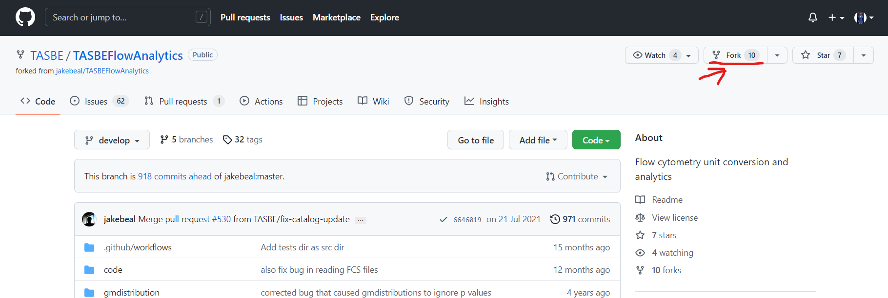

Open GitHub Desktop

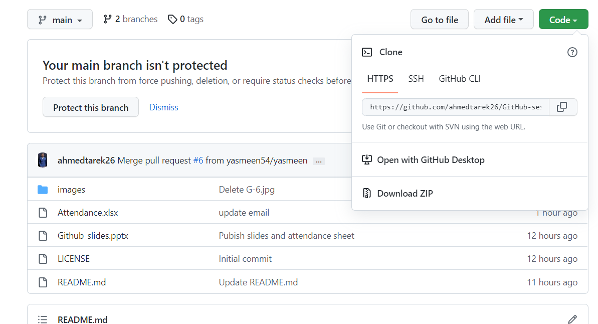

Use GitHub Desktop to clone the forked repo to work on it in your local device

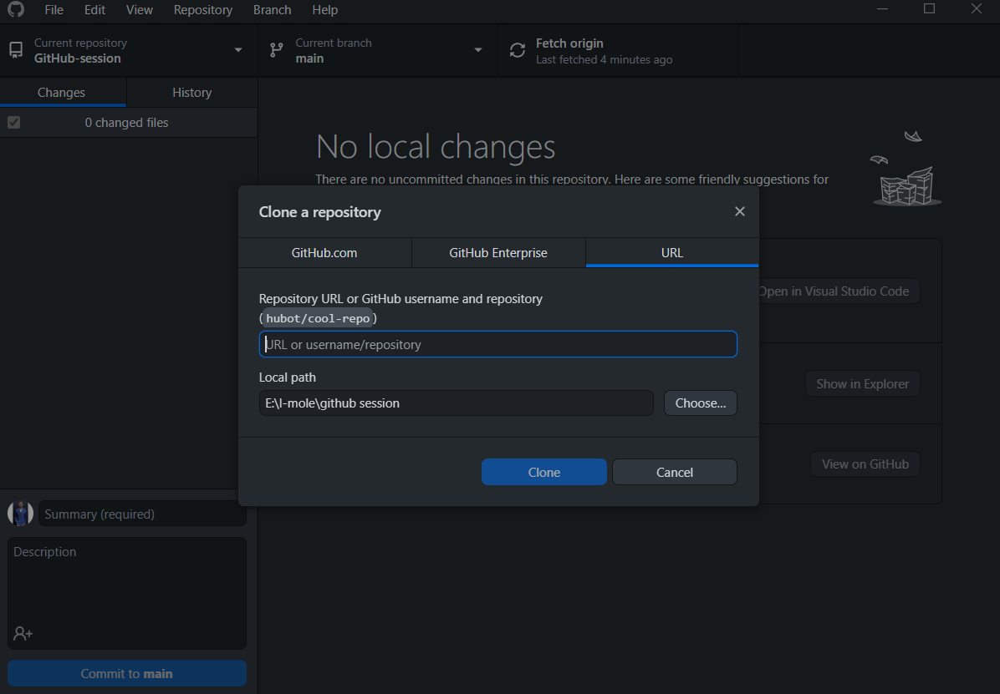

### 2.create a branch 
Branches are the preferred way to create changes in the GitHub flow.

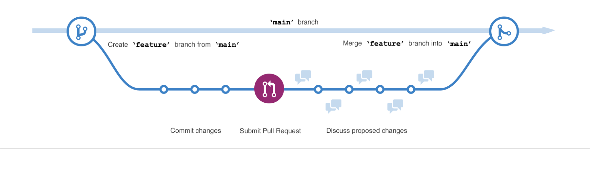

Create a new branch to make changes away from the original repo and to create save pull request

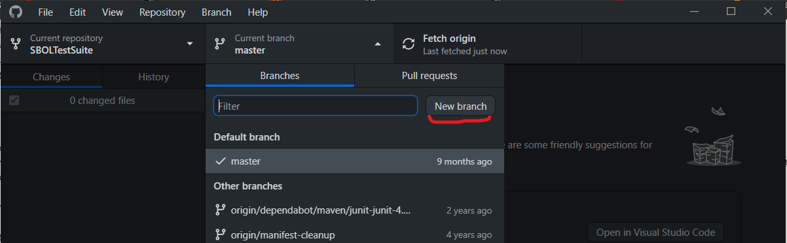

### 3.make a change
Make changes that you want and then open GitHub Desktop

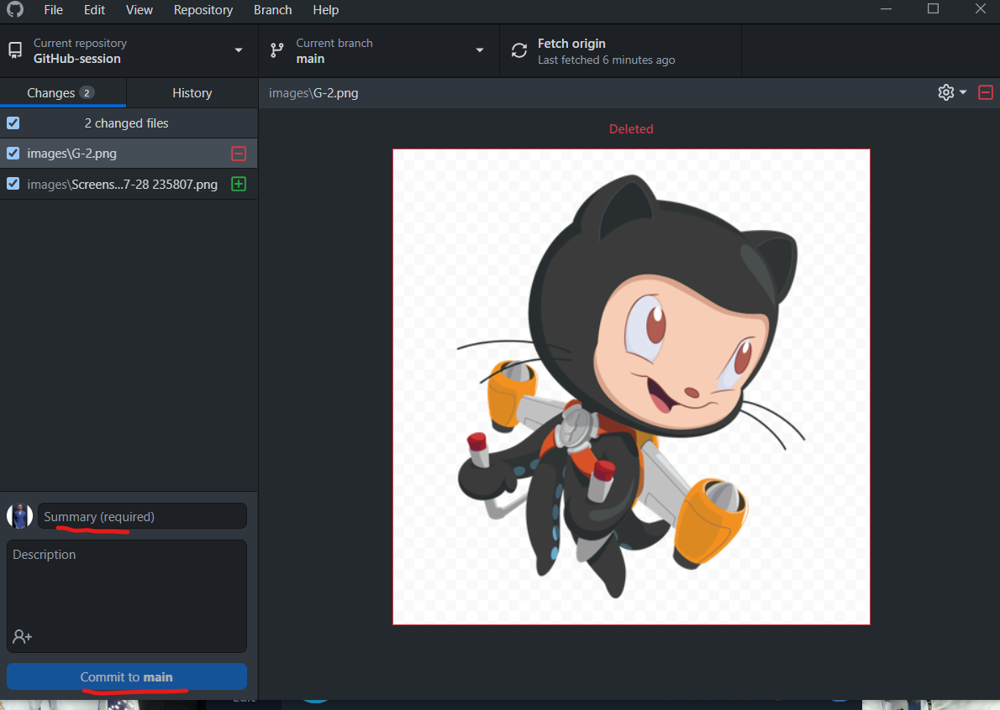

If you aren't the owner of the repo , don't forget to make changes on your branch

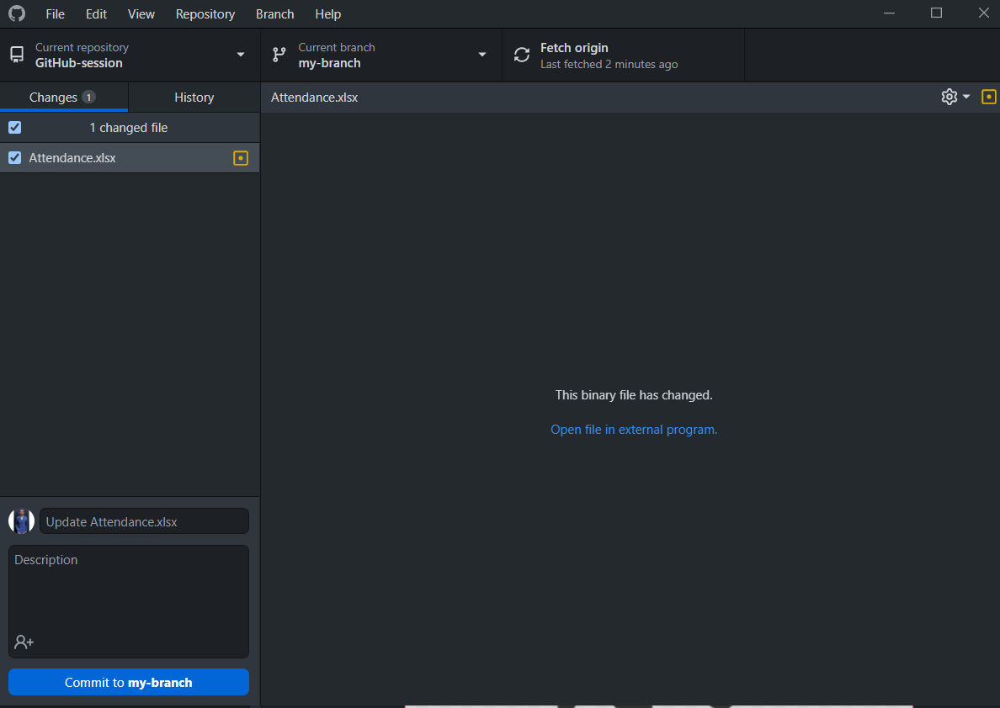

### 4.push it
After commit your changes publish the branch 

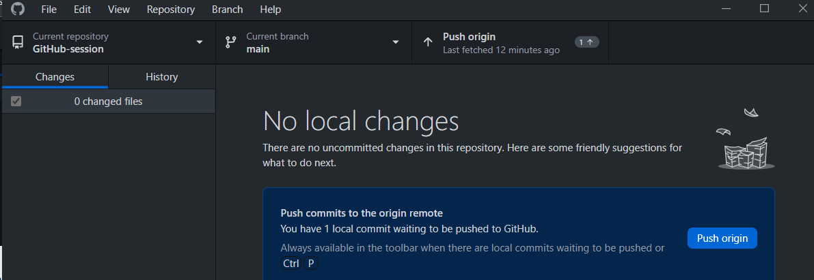

then create pull request

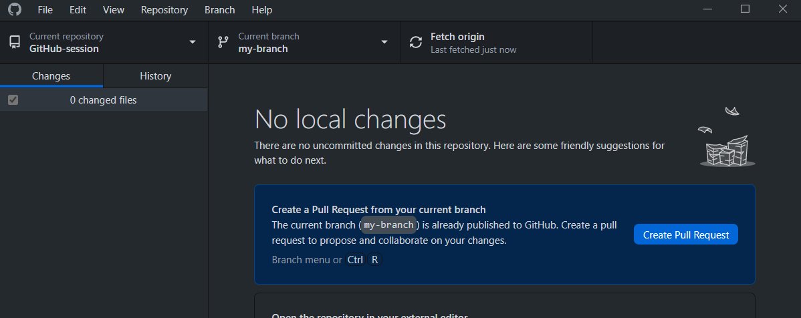

### 5.delete branch

if you won't to make more updates on the replater , you can delete your branch

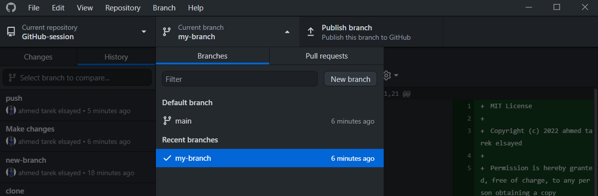

### Task
Try to follow these steps above and make changes by add your name on Attendance excel sheet.
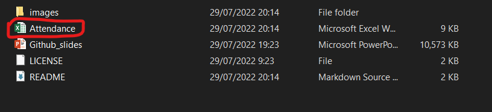

  

If you need help, contact Ahmed Tarek:  
Email: ahmedtarek2632@gmail.com

